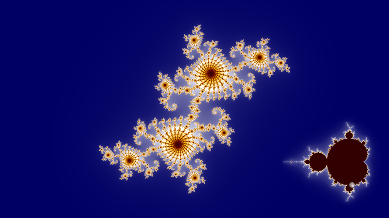
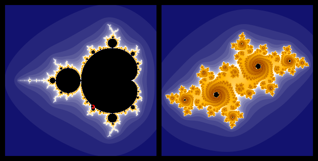
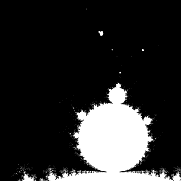
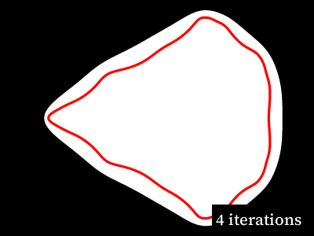
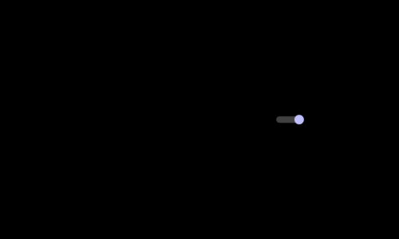

In this repo is a series of scripts that can animate the Julia set as found along the edge of the Mandelbrot set.  You can see a [preview of the animation this produces here on YouTube](https://youtu.be/MN7ddsgY-jk).  Before I talk about how this works, a background on what this is in the first place:

# Background

The Mandelbrot set is a visualization of the iterative formula zn+1=zn2+c, where _c_ is a complex number representing a point, and _z_ starts as zero.  [Wikipedia has more details](https://en.wikipedia.org/wiki/Mandelbrot_set), but the basic idea is that for every point within a 2D plane, a formula is run repeatedly till the value it produces trends towards infinity.  If that point never escapes, then it's inside the set, if it does escape, the number of iterations it took to escape is used to color the final image.

The Julia set can be drawn with the same formula, just changing _c_ to be a constant value for all points in a grid, and _z_ starting with the value for a given point.  This means each point on the Mandelbrot set has a corresponding Julia set

The points near the edge of the Mandelbrot set (that is to say, the points inside the set that do not escape) make for more interesting Julia sets.

# Details

Not only do the points along the edge of the Mandelbrot set make for interesting Julia sets, two points near each other produce similar Julia sets.  This project attempts to run along the Mandelbrot set, find all of the points running around the set, and generate the corresponding Julia set for an animation.  Before that, though, there are a few problems that need to be solved.

## The border of the Mandelbrot set

Actually finding the border turns out to be a nuanced problem.  Before I go on, I should clarify:  I'm attacking this problem mostly from a computer science viewpoint.  There are no doubt exact mathematical answers to these questions, but my goal is to produce an animation at the end of all of this, which introduces some concrete requirements on the data I produce, along with the fact I wanted to see if I could do this with minimal outside help.  That is to say:  There are no doubt better more correct ways to answer these problems and questions.  These are just the answers I came up with.

Back to the question.  The simple solution to this problem would be to draw a line around the edge of the Mandelbrot set at a high iteration.  There are at least two issues with this approach:  At a high enough iteration, there exist disconnected "islands" in the Mandelbrot set.  In principle, these islands are all connected, but it quickly requires incredibly high resolutions to find how these islands are connected.  

For a formula looking at the same resolution, finding out how these islands are connected quickly becomes problematic:

More practically:  The closer one gets to the Mandelbrot set itself, the less interesting and more chaotic the corresponding Julia sets appear, at least to my eye.  This is purely subjective, but I ended up using 39 iterations.  As this produces a reasonable border given the system I describe below, and produces interesting enough Julia set images along the edge.

## Finding the border

Then the question becomes one of finding the border.  The simplest most direct approach is simply to calculate out a Mandelbrot set at a sufficiently high resolution, and use some path finding [algorithm like A*](https://en.wikipedia.org/wiki/A*_search_algorithm) to find a path along the border.

This works, and is basically what I ended up doing, with two modifications:

For the purposes of finding the border, "sufficiently high resolution" turns out to be something around ten million by ten million pixels.  Even if I only use one bit per pixel, this still ends up being something on the order of ten terabytes of data, which is slightly more than I can stuff in memory to have any hope of a performant pathfinding algorithm.

Since one of the features of the Mandelbrot set calculation is that one can calculate any point independently of any other point, I don't need to calculate the entire set in advance.  Rather I calculate a few points together, and effectively create a function that takes a x and y coordinate as input, and returns "is this a point along the border?" as output.  I can use this along with some caching of results and the A* path finding algorithm to find a path along the border.

The only other change again revolves around the practicalities of dealing with such a high resolution:  Instead of storing every point along the path that this process results in, I only track a point if it's some set distance away from the previously tracked point.  This shrinks the final set of points from billions down to around two million points with the distance target I used.

## Animating the result

Two million Julia sets would result in something like ten hours of video, which is probably more than anyone would be interested in watching.  So, I picked an arbitrary target of fifteen thousand frames to render, or a little more than four minutes of video at sixty frames per second.

While one solution is to simply pick equidistant points along the border, this produces a jittery animation, as points near each other on the Mandelbrot set produce similar Julia set images, but not necessarily always the same amount of similarity.  

Because there are a few different factors at play here, I found it easiest, if not quickest, to render all of the two million frames.  I then used a simple Manhattan distance calculation to see how visually near each frame is to the next frame.  I ran through and removed the frame that was the closest to its neighbor.  Updating my calculations for the new neighbors after each removal, since removing a frame in a sequence might cause the two new neighbors to be closer than any other frame in the image.  I repeat the process till I've whittled down the possible points to my target count.

From there it's just a matter of producing a high resolution render for the target points, and producing a video file from the images produced.

# Putting it all together

The files in this repo are the results of my little experiments to produce this animation.  While these scripts are the ones I used, they are by no means user-friendly, or easy to follow.  I was playing with different ideas and techniques as I went along.  I present them as is, with no real instructions on how to run them, other than noting "edge_julia.py" is the main entry point, and settings are controlled by changing "options.py".

If you have questions, feel free to [send them my way](mailto:scott.seligman@gmail.com).
